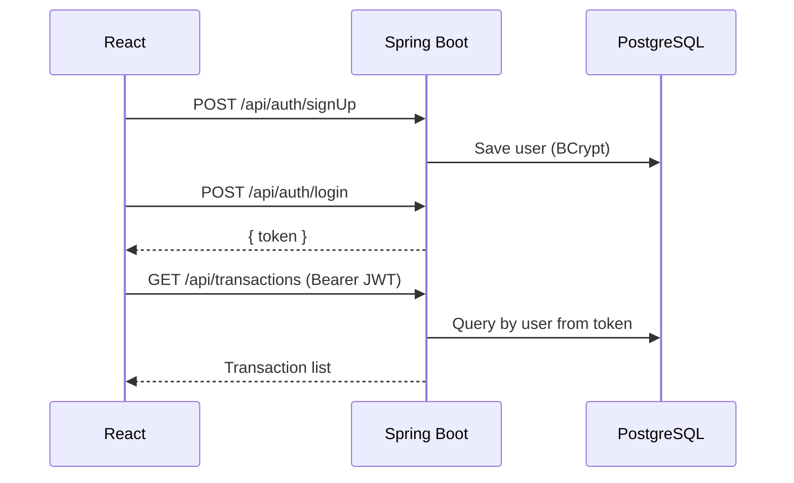

# Smart Financial Tracker

Full-stack personal finance app: **Spring Boot** REST API (Java 17, PostgreSQL, JWT) and a **React** dashboard in one repository.

Track income and expenses, see monthly and category breakdowns, and browse finance headlines — all scoped to the signed-in user.

[](https://github.com/YOUR_GITHUB_USERNAME/smart-financial-tracker/actions/workflows/ci.yml)
[](https://openjdk.org/projects/jdk/17/)
[](https://spring.io/projects/spring-boot)
[](https://react.dev/)
[](https://www.postgresql.org/)

---

## Features

- Email sign-up / login with **JWT** (BCrypt passwords, stateless Spring Security)
- Add income and expense transactions per user
- Dashboard totals: income, expense, balance
- Monthly summary and category breakdowns
- Sidebar modules: Overview, Transactions, Analytics, Finance News, Insights
- Light / dark theme
- Production image serves the React build from Spring so you get **one live URL**

---

## Tech stack

| Layer | Stack |
|--------|--------|
| Backend | Java 17, Spring Boot 3.4, Spring Security, Spring Data JPA |
| Auth | JWT (jjwt), BCrypt |
| Database | PostgreSQL (H2 for tests) |
| Frontend | React 18, React Router 6, Vite 5 |
| CI / deploy | GitHub Actions, Docker, Render-ready |

---

## Architecture

```
Browser (React)
    │  JWT in Authorization header
    ▼
Spring Boot API  ──►  PostgreSQL
    │
    └── /api/auth/** public
        /api/transactions/** authenticated
```



---

## Project layout

```
smartFinancialTracker/
├── src/main/java/...     Spring Boot API
├── src/main/resources/   Config (env-driven)
├── frontend/             React (Vite)
├── Dockerfile            Production image (UI + API)
├── render.yaml           Render blueprint
└── .github/workflows/    CI
```

---

## Local setup

**Prerequisites:** JDK 17, PostgreSQL, Node.js 18+

### 1. Database

```sql
CREATE DATABASE smart_financial_tracker;
```

Defaults (override with env vars or `.env` values — see `.env.example`):

| Setting | Default |
|---------|---------|
| URL | `jdbc:postgresql://localhost:5432/smart_financial_tracker` |
| User | `postgres` |
| Password | `postgres` |
| API port | `8081` |

### 2. Backend

```powershell
.\gradlew.bat bootRun
```

API: **http://localhost:8081**

### 3. Frontend

```powershell
cd frontend
npm install
npm run dev
```

UI: **http://localhost:5173**

Vite proxies `/api` to port `8081` in development.

### 4. Try it

1. Open http://localhost:5173  
2. Sign up, then add an income or expense  
3. Check Overview and Analytics  

---

## REST API

Base URL: `http://localhost:8081`

### Auth (public)

| Method | Path | Body | Response |
|--------|------|------|----------|
| POST | `/api/auth/signUp` | `{ "fullName", "email", "password" }` | `{ id, fullName, email }` |
| POST | `/api/auth/login` | `{ "email", "password" }` | `{ "token": "..." }` |

### Transactions (Bearer token)

| Method | Path | Notes |
|--------|------|--------|
| POST | `/api/transactions/addTrans` | See JSON below |
| GET | `/api/transactions` | Optional `?type=INCOME` or `EXPENSE` |
| GET | `/api/transactions/summary` | All-time totals |
| GET | `/api/transactions/summary/overall?date=2026-05-17` | Totals for one day |
| GET | `/api/transactions/summary/monthly?year=2026&month=5` | Month totals |
| GET | `/api/transactions/summary/categories?type=EXPENSE` | Per-category sums |

```json
{
  "amount": 49.99,
  "category": "Food",
  "description": "Lunch",
  "date": "2026-05-17",
  "type": "EXPENSE"
}
```

`type` is `INCOME` or `EXPENSE`. `date` is `YYYY-MM-DD`.

---

## Configuration

| Variable | Purpose |
|----------|---------|
| `SPRING_DATASOURCE_URL` | JDBC URL (or set `DATABASE_URL` as `postgres://...`) |
| `SPRING_DATASOURCE_USERNAME` / `PASSWORD` | DB credentials |
| `JWT_SECRET` | Signing key (32+ characters) |
| `CORS_ALLOWED_ORIGINS` | Comma-separated frontend origins |
| `PORT` | HTTP port (Render sets this) |
| `VITE_API_BASE_URL` | Frontend API origin; empty when UI is served by Spring |
